# 💸 Birikim Ajandası — Kişisel Finans Takip ve Analiz Uygulaması

## 🧩 Genel Bakış
**Birikim Ajandası**, bireylerin gelir ve giderlerini akıllı şekilde yönetmelerini sağlamak için geliştirilmiş, yapay zekâ destekli bir **kişisel finans takip uygulamasıdır**.  
Proje, kullanıcı harcamalarını analiz eder, PDF banka ekstrelerinden otomatik veri çıkarımı yapar ve kullanıcıya özel **tasarruf önerileri** sunar.

> 🎓 Bu çalışma, Bilgisayar Mühendisliği Bitirme Tezi kapsamında hazırlanmıştır.

---

## 🎯 Projenin Amacı
Modern yaşamda bireylerin gelir–gider takibini manuel olarak sürdürmeleri zorlaşmaktadır.  
**Birikim Ajandası**, bu süreci otomatikleştirerek kullanıcının finansal farkındalığını artırmayı ve bütçe planlamasına destek olmayı hedefler.

Uygulama:
- Banka ekstrelerinden verileri otomatik okur,  
- Harcama açıklamalarını doğal dil işleme (NLP) ile sınıflandırır,  
- Harcama analizlerini grafiksel olarak sunar,  
- Yapay zekâ tabanlı öneriler üretir.

---

## ⚙️ Teknik Özellikler

### 🚀 Kullanılan Teknolojiler
| Katman | Teknolojiler |
|--------|---------------|
| **Frontend** | React (Vite), Tailwind CSS, Chart.js |
| **Backend** | Python (Flask), REST API, PyMuPDF |
| **Yapay Zekâ** | FastText, Logistic Regression, Falcon-RW-1B |
| **Veritabanı** | Firebase |
| **Destekleyici Kütüphaneler** | Pandas, NumPy, Scikit-learn, Gensim, Transformers |

---

## 🧠 Uygulama Akışı
1. **Kullanıcı**, PDF formatındaki banka ekstresini yükler.  
2. **Flask Sunucusu**, PyMuPDF kullanarak ekstredeki metinleri ayrıştırır.  
3. **FastText + Logistic Regression modeli**, harcama açıklamalarını sınıflandırır (örn. “Gıda”, “Ulaşım”, “Fatura”).  
4. **Falcon-RW-1B modeli**, harcama alışkanlıklarına göre kişiye özel finansal öneriler üretir.  
5. **Frontend (React)**, sonuçları grafiksel raporlar ve öneriler şeklinde kullanıcıya sunar.

---

## 🧾 Özellikler
- 📄 **PDF Harcama Analizi:** Ekstrelerden otomatik veri çıkarımı  
- 🤖 **Yapay Zekâ Sınıflandırma:** Açıklamalardan kategori tahmini  
- 💬 **AI Tavsiye Modülü:** Kişisel harcama önerileri  
- 📊 **Finansal Görselleştirme:** Gelir–gider dengesi ve harcama oranları  
- 🔐 **Bulut Tabanlı Depolama:** Firebase ile kullanıcı verilerinin saklanması  

---

## 🧩 Sistem Mimarisi
📄 PDF → 🧠 NLP + FastText Model → 🔍 Logistic Regression → 📊 React Dashboard
---

**Birimler:**
- `client/` → React.js tabanlı kullanıcı arayüzü  
- `server/` → Flask tabanlı REST API  
- `uploads/` → Kullanıcı PDF dosyalarının geçici depolama alanı  
- `category_rules.py` → Harcama açıklamalarını önceden tanımlı kurallarla eşleştirme  
- `ignore_rules.py` → Model dışı (önemsiz) açıklamaları filtreleme  

---

## 📸 Ekran Görselleri

| Özellik | Görsel |
|----------|--------|
| Giriş Ekranı (Masaüstü) | 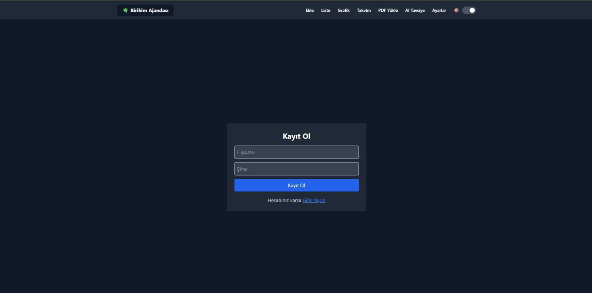 |
| Harcama Listesi (Mobil) | 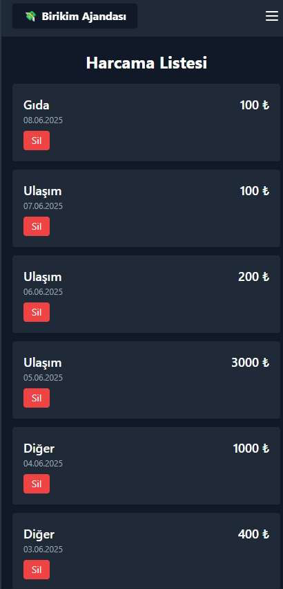 |
| Firebase Kullanıcı Yönetimi | 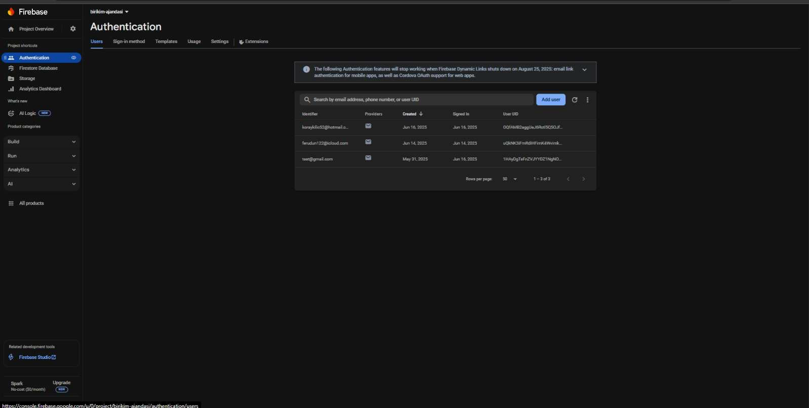 |
| Hoş Geldiniz Ekranı (Masaüstü) |  |
| Kayıt Olma Ekranı (Mobil) | 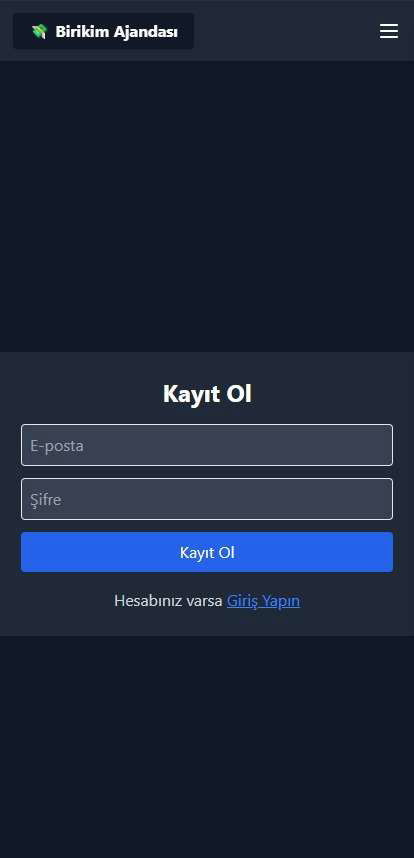 |
| Firebase Harcama Detayları | 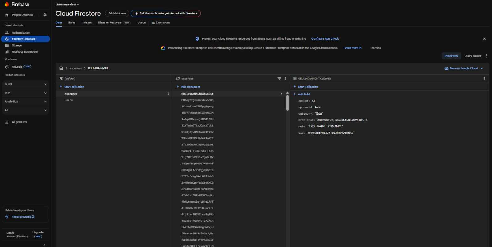 |
| Yapay Zeka Tavsiye Ekranı | 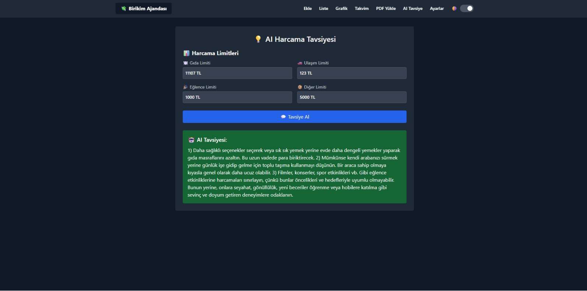 |
| Harcama Ekleme Ekranı | 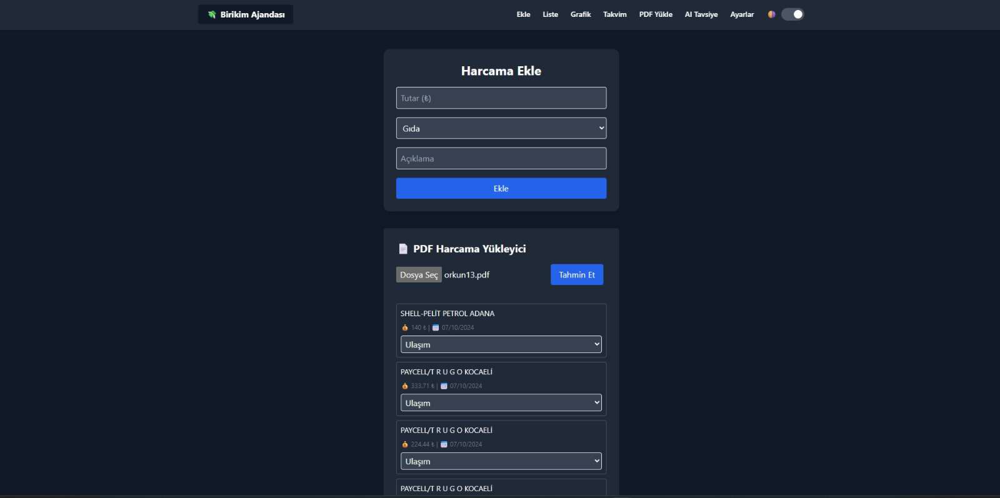 |
| Harcama Listesi (Masaüstü) | 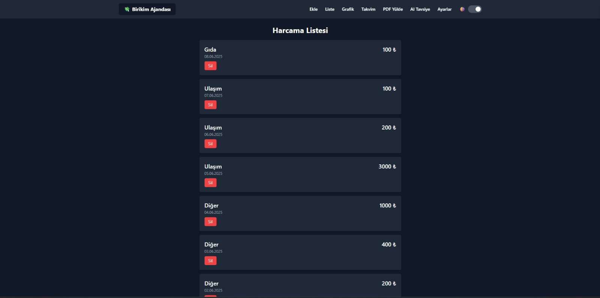 |
| Harcama Takvimi (Mobil) | 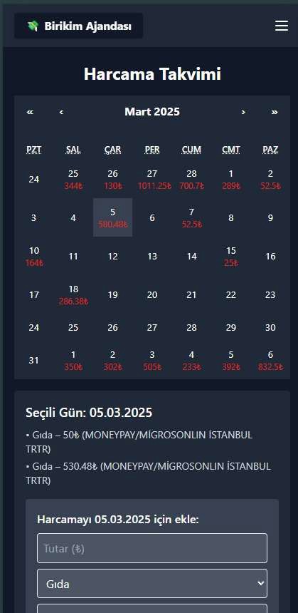 |
| Yapay Zeka Tavsiyesi (Mobil) | 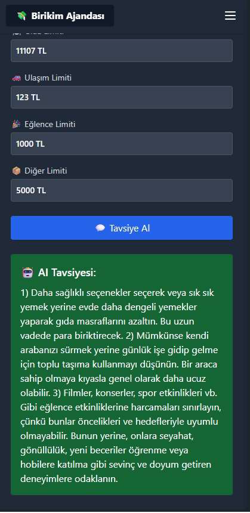 |
| Zaman Bazlı Harcama Grafiği |  |
| Kategori Bazlı Harcama Dağılımı | 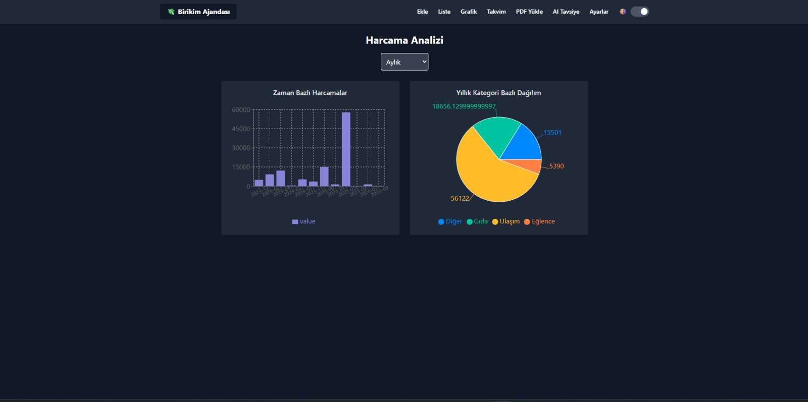 |

> 📁 Görseller `screenshots/` klasöründe yer almaktadır.

---

## 💾 Kaynak Kod ve Dosyalar

Bu GitHub deposu, **projenin yapısını ve belgelerini** içermektedir.  
Tam çalışan proje dosyaları (5 GB) aşağıdaki bağlantıda paylaşılmıştır:

🔗 **[Google Drive — Birikim Ajandası (Full Project)](https://drive.google.com/file/d/1SeB1vooO301KrCn3EFiZk9h7QuySqzhZ/view?usp=sharing)**

---

## 📘 Akademik Bilgiler
**Proje Adı:** Birikim Ajandası — Kişisel Finans Takip Uygulaması  
**Hazırlayan:** Orkun İnan  
**Teslim Tarihi:** Haziran 2025  
**Not:** AA (4.00 / 4.00)  

---

## 👨‍💻 Geliştirici
**Orkun İnan**  
💼 Bilgisayar Mühendisi  
📧 orkun.inan@outlook.com.tr  
🌐 [linkedin.com/in/orkun-inan-983bb3310](https://www.linkedin.com/in/orkun-inan-983bb3310)
